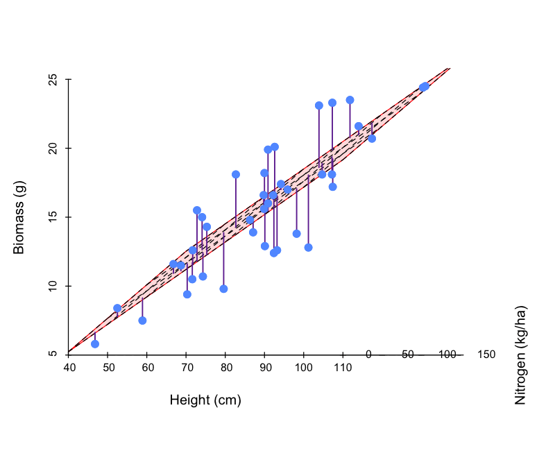

# plotgif

Turn a list of R plots into an animated GIF, in one call.

```r
# install once
install.packages("remotes")
remotes::install_github("greymonroe/plotgif")

library(plotgif)
```

No install? Source the one file straight from GitHub (needs the `magick` package):

```r
source("https://raw.githubusercontent.com/greymonroe/plotgif/main/R/make_gif.R")
```

## make_gif()

Give it a list of plots in order. Each element is a **ggplot object** or a **function with no
arguments that draws with base graphics**. It writes one PNG per frame and stitches them.

```r
library(ggplot2)

frames <- lapply(5:50, function(n) {
  ggplot(mtcars[1:n, ], aes(wt, mpg)) + geom_point() + xlim(1, 6) + ylim(10, 35) +
    labs(title = paste(n, "cars")) + theme_classic()
})
make_gif(frames, file = "mtcars.gif", dir = "gifs", width = 600, height = 450, fps = 8)
```

```r
# base graphics: wrap the drawing code in function()
frames <- lapply(seq(0, 2 * pi, length.out = 40), function(a) function() {
  plot(cos(a), sin(a), xlim = c(-1, 1), ylim = c(-1, 1), pch = 16, cex = 3, xlab = "", ylab = "")
})
make_gif(frames, "circle.gif", width = 400, height = 400, fps = 20)
```

Arguments: `file`, `dir`, `width`, `height` (pixels), `fps` or per-frame `delay` (seconds,
e.g. `delay = c(rep(0.1, 9), 1)` to hold the last frame), `loop` (0 = forever), `res`
(text size), `keep_frames = TRUE` to keep the PNGs.

## Example: a rotating regression plane

The teaching case this was built for. Write a function that draws one frame, `lapply()` it
over the thing that changes (here the viewing angle), and hand the list to `make_gif()`.
The same three steps make any animation: a growing dataset, a moving threshold, a
bootstrap, a simulation unfolding.

```r
library(scatterplot3d)
wheat  <- read.csv("https://greymonroe.github.io/PLS_206/data/wheat_plants.csv")
model2 <- lm(biomass ~ height + nitrogen, data = wheat)

# 1. a function that draws one frame: points, the fitted plane, and the residuals
plane_frame <- function(angle) {
  s3 <- scatterplot3d(wheat$height, wheat$nitrogen, wheat$biomass, angle = angle,
                      pch = 16, color = "#619CFF", zlim = c(5, 30), box = FALSE,
                      xlab = "Height (cm)", ylab = "Nitrogen (kg/ha)", zlab = "Biomass (g)")
  s3$plane3d(model2, draw_polygon = TRUE, polygon_args = list(col = adjustcolor("red", 0.15), border = "red"))
  obs <- s3$xyz.convert(wheat$height, wheat$nitrogen, wheat$biomass)    # 3D -> 2D
  fit <- s3$xyz.convert(wheat$height, wheat$nitrogen, fitted(model2))
  segments(obs$x, obs$y, fit$x, fit$y, col = "purple")                   # residuals
  points(obs$x, obs$y, pch = 16, col = "#619CFF")
}

# 2. one frame per angle, 3. stitch
frames <- lapply(seq(0, 355, by = 5), function(a) function() plane_frame(a))
make_gif(frames, file = "plane.gif", dir = "gifs", width = 800, height = 650, fps = 12)
```



## Why

Built for [PLS 206](https://greymonroe.github.io/PLS_206/) (Applied Multivariate Modeling,
UC Davis), so that course scripts can make an animation in a few readable lines.
